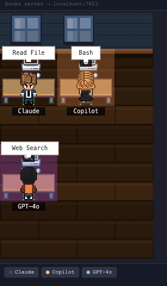

# Multi-Agent Pixel Office

Visualize concurrent GitHub Copilot and Claude Code sessions, including subagents, as animated pixel-art characters inside VS Code or code-server.



## Features

- Shows multiple GitHub Copilot and Claude Code sessions at the same time.
- Distinguishes main agents from subagents and displays parent relationships.
- Shows provider, workspace, current activity, active tool, target, and update time.
- Uses a local Python broker so multiple extension hosts share one state stream.
- Binds the broker to `127.0.0.1` and authenticates hook writes with a local token.
- Does not send telemetry or agent data to an external service.

## Requirements

- VS Code or a compatible code-server build based on VS Code 1.94 or later.
- Python 3.9 or later available as `python3`, through `PYTHON`, or configured with `multiAgentPixelOffice.pythonPath`.
- GitHub Copilot and/or Claude Code with local hook support.

## Setup

1. Install the extension.
2. Run **Multi-Agent Pixel Office: Install GitHub Copilot and Claude Code Hooks** from the Command Palette.
3. Open **Multi-Agent Pixel Office** from the Activity Bar.
4. Start one or more Copilot or Claude Code agent sessions.

The installer is idempotent and only manages entries that point to this extension's own hook under `~/.multi-agent-pixel-office/`. It preserves hooks belonging to other tools and extensions.

### Files managed locally

| Path | Purpose |
| --- | --- |
| `~/.multi-agent-pixel-office/hook.py` | Minimal local hook client |
| `~/.multi-agent-pixel-office/port` | Broker loopback port |
| `~/.multi-agent-pixel-office/token` | Random hook authentication token, mode `0600` where supported |
| `~/.copilot/hooks/hooks.json` | GitHub Copilot hook registration |
| `~/.claude/settings.json` | Claude Code hook registration |

Existing JSON files are backed up once before the extension changes them.

## Privacy and security

The broker reads local VS Code/Copilot and Claude Code session metadata to discover concurrent sessions and subagents. It publishes only the fields needed by the visualization, such as provider, session identifier, workspace label, tool name, sanitized target, timestamps, and token counts when available.

- HTTP listens only on `127.0.0.1`.
- Snapshot, event-stream, status, and hook requests require a random local token.
- Request bodies and response sizes are bounded.
- Tool targets are reduced to relative paths or basenames when possible.
- Prompt text, model responses, environment variables, and credentials are not displayed or persisted by the extension.

## Settings

| Setting | Default | Description |
| --- | --- | --- |
| `multiAgentPixelOffice.port` | `7933` | Loopback port used by the local broker. |
| `multiAgentPixelOffice.pythonPath` | empty | Python 3 executable. Empty uses `PYTHON`, `PYTHON3`, or `python3`. |
| `multiAgentPixelOffice.autoShowPanel` | `false` | Opens the office panel after startup. |

## Development

```bash
npm install
npm --prefix webview-ui install
npm run vscode:prepublish
npm run check
```

Press `F5` to launch an Extension Development Host. Build a VSIX with `npm run package`.

## Attribution and trademarks

This is an independent, unofficial project and is not affiliated with or endorsed by Microsoft, GitHub, Anthropic, or the upstream authors.

The project is a modified derivative of **Copilot Pixel Agents**, originally copyright © 2026 Clesley Oliveira and distributed under the MIT License. Pixel-art assets are derived from `pablodelucca/pixel-agents` under the MIT License; character sprites are based on the “JIK-A-4, Metro City” tileset. See [LICENSE](LICENSE) for the retained notices.

GitHub, GitHub Copilot, Microsoft, VS Code, Claude, Claude Code, and Anthropic are trademarks of their respective owners.
